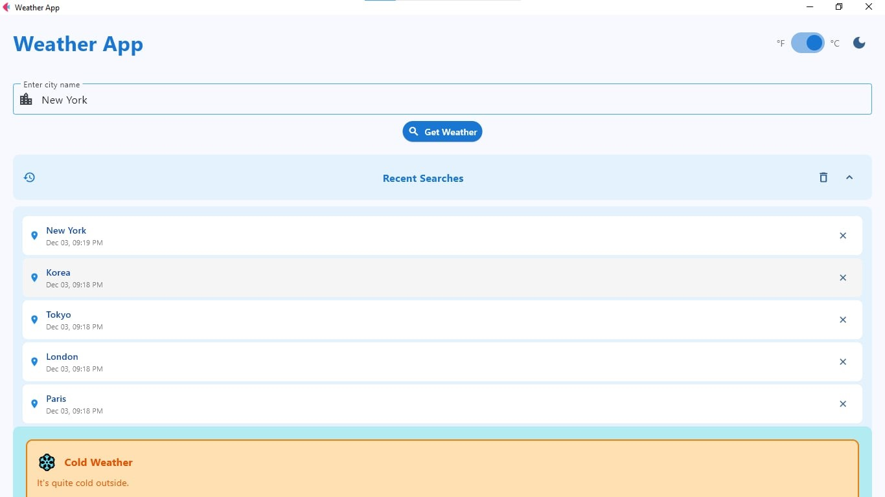

# Weather Application - Module 6 Lab

## Student Information
- **Name**: [Borac John Joshua]
- **Student ID**: [231005103]
- **Course**: CCCS 106
- **Section**: [BSCS 3B]

## Project Overview
[The Weather Application provides real-time weather information for any city the user searches for. It displays key details such as temperature, humidity, wind speed, and weather conditions using a clean and modern Material Design interface. The app also includes enhanced features like search history, temperature unit conversion, visual condition indicators, weather alerts, and optional voice input. Overall, it aims to deliver an intuitive and accessible way for users to check and understand current weather conditions quickly.]

## Features Implemented

### Base Features
- [x] City search functionality
- [x] Current weather display
- [x] Temperature, humidity, wind speed
- [x] Weather icons
- [x] Error handling
- [x] Modern UI with Material Design

### Enhanced Features
1. **[Search History (Easy)]**
   - Store the last 5-10 searched cities Display them in a dropdown or list Allow quick re-search by clicking on history items Persist  history using local file storage (json file)
   - I chose this feature to improve usability by reducing the need to type frequently searched locations and to provide quick access to recent queries.
   - A challenge was ensuring the history didn’t exceed the limit and handling duplicates. I solved this by checking if a city already exists before adding it, and by removing the oldest entry when the list reaches its maximum size.

2. **[Temperature Unit Toggle (Easy)]**
   - This feature allows users to switch between Celsius and Fahrenheit using a button or toggle. The displayed weather data automatically converts and updates based on the chosen unit, which is saved as the user’s preference.
   - I selected this feature because users have different comfort levels with temperature units depending on their region.
   - The main challenge was ensuring accurate conversion while keeping the UI updated smoothly. I resolved this by implementing a temperature conversion function and applying it dynamically whenever the toggle changes.

3. **[Weather Condition Icons and Colors (Easy)]**
    - This feature changes the background color depending on the weather (e.g., yellow for sunny, blue for rainy) and uses icons or emojis to visually represent conditions. Smooth color transitions make the interface more engaging.
    - I chose this feature to enhance visual appeal and make the weather status more intuitive at a glance.
    - A challenge was mapping different weather codes to appropriate visuals. I handled this by creating a dictionary that matches condition keywords (like “Clear”, “Rain”, “Clouds”) to specific icons and colors.

4. **[Weather Alerts and Warnings (Medium)]**
    - This feature shows warnings for extreme conditions, such as high heat, storms, or very low temperatures. It displays banners or icons and provides helpful recommendations like “Wear sunscreen” or “Bring an umbrella.”
    - I included this feature to make the app more informative and safety-oriented, going beyond basic weather data.
    - The biggest challenge was detecting which conditions qualify as “extreme.” I solved this by setting threshold values and checking them against the API data before showing alerts.

## Screenshots
[Search History]


[Weather Alerts and Warnings]


[Weather Condition Icons and Colors]

## Installation

### Prerequisites
- Python 3.8 or higher
- pip package manager

### Setup Instructions
```bash
# Clone the repository
git clone https://github.com/joshborac-oss/cccs106-projects.git
cd cccs106-projects/mod6_labs

# Create virtual environment
python -m venv venv
source venv/bin/activate  # On Windows: venv\Scripts\activate

# Install dependencies
pip install -r requirements.txt

# Create .env file
cp .env.example .env
# Add your OpenWeatherMap API key to .env

