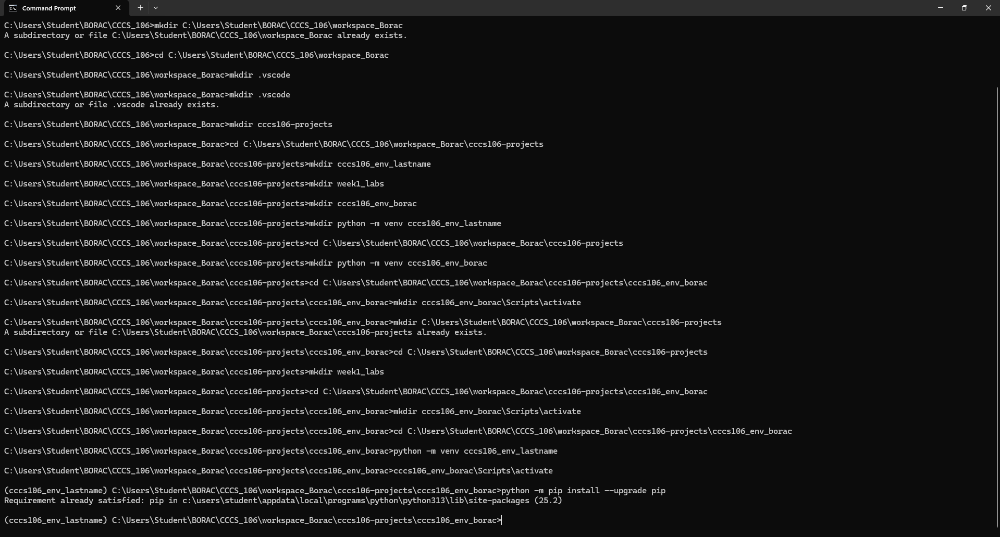
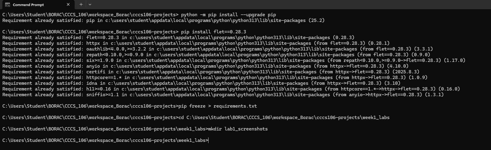
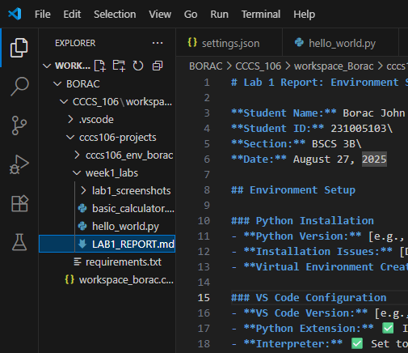
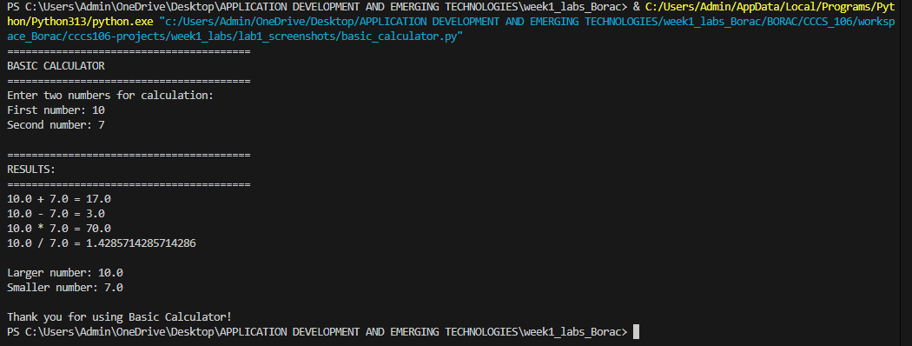

# Lab 1 Report: Environment Setup and Python Basics

**Student Name:** Borac John Joshua A.\
**Student ID:** 231005103\
**Section:** BSCS 3B\
**Date:** August 27, 2025

## Environment Setup

### Python Installation
- **Python Version:** [e.g., 3.11.5]
- **Installation Issues:** [Describe any problems and solutions]
- **Virtual Environment Created:** ✅ cccs106_env_lastname

### VS Code Configuration
- **VS Code Version:** [e.g., 1.82.0]
- **Python Extension:** ✅ Installed and configured
- **Interpreter:** ✅ Set to cccs106_env_lastname/Scripts/python.exe

### Package Installation
- **Flet Version:** 0.28.3
- **Other Packages:** [List any additional packages]

## Programs Created

### 1. hello_world.py
- **Status:** ✅ Completed
- **Features:** Student info display, age calculation, system info
- **Notes:** Faced minor challenges with getting the correct system information output and formatting the age calculation properly, but overall the code was straightforward and served as a good refresher on Python basics.\

### 2. basic_calculator.py
- **Status:** ✅ Completed
- **Features:** Basic arithmetic, error handling, min/max calculation
- **Notes:** The main challenge was handling invalid user inputs and preventing division by zero errors. I also observed that adding min/max functionality made the program more practical, but it required careful comparison logic to avoid incorrect results.\

## Challenges and Solutions

One of the main challenges I encountered was handling invalid inputs in the calculator program, such as when the user entered letters instead of numbers or attempted division by zero. To solve this, I used try-except blocks in Python to catch errors and display a clear message instead of crashing the program.

Another difficulty was making the age calculation accurate in the hello_world.py program. At first, the calculation didn’t account for whether the birthday had already passed in the current year. I fixed this by comparing the current month and day with the user’s birthdate before finalizing the age.

Lastly, formatting the system information output was a bit tricky since some details were cluttered. I addressed this by breaking the output into sections and labeling each value clearly, which made the program easier to read.\

## Learning Outcomes

Through these activities, I learned how Python can be used not just for simple outputs but also for building programs that interact with users and handle real data. Working with files like hello_world.py and basic_calculator.py helped me understand how important input validation and error handling are in making a program reliable. I also became more comfortable using the development environment, from writing and running scripts to fixing errors that appeared during execution.

Another key outcome was gaining confidence in applying Python’s built-in functions and modules—for example, using datetime for age calculation and system libraries for displaying information. These small but practical exercises showed me how programming is not just about syntax but also about solving problems logically and making code easier for users to understand.

Most importantly, I realized that even basic projects can strengthen my problem-solving skills and give me a clearer idea of how larger applications are built step by step.\

## Screenshots

