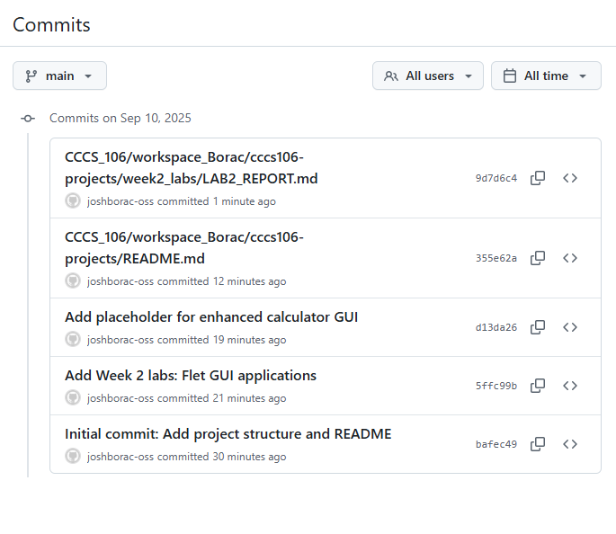

# Lab 2 Report: Git Version Control and Flet GUI Development

**Student Name:** John Joshua A. Borac
**Student ID:** 231005103
**Section:** BSCS 3B
**Date:** SEPTEMBER 10

## Git Configuration

### Repository Setup
- **GitHub Repository:** https://github.com/joshborac-oss/cccs106-projects
- **Local Repository:** ✅ Initialized and connected
- **Commit History:** [5] commits with descriptive messages

### Git Skills Demonstrated
- ✅ Repository initialization and configuration
- ✅ Adding, committing, and pushing changes
- ✅ Branch creation and merging
- ✅ Remote repository management

## Flet GUI Applications

### 1. hello_flet.py
- **Status:** ✅ Completed
- **Features:** Interactive greeting, student info display, dialog boxes
- **UI Components:** Text, TextField, Buttons, Dialog, Containers
- **Notes:** While working on this file, I learned how to connect input fields with button actions to update the UI dynamically. I also explored the use of dialogs for displaying confirmation messages, which gave me a clearer understanding of Flet’s event handling flow. Managing the layout with containers and alignment options was essential for keeping the interface clean and organized. One minor challenge I faced was remembering to call page.update() after every state change, since updates wouldn’t reflect without it.

### 2. personal_info_gui.py
- **Status:** ✅ Completed
- **Features:** Form inputs, dropdowns, radio buttons, profile generation
- **UI Components:** TextField, Dropdown, RadioGroup, Containers, Scrolling
- **Error Handling:** Input validation and user feedback
- **Notes:** In this program, I worked on building a more structured form with different input types such as text fields, dropdowns, and radio buttons. The combination of these components made it possible to generate a simple user profile based on the provided information. I also implemented basic error handling by validating inputs and giving feedback whenever a field was left empty or incorrectly filled, which improved the program’s usability. One observation was that scrolling became necessary as the form grew in size, and properly using containers helped in keeping the layout organized and responsive.

## Technical Skills Developed

### Git Version Control
- Understanding of repository concepts
- Basic Git workflow (add, commit, push)
- Branch management and merging
- Remote repository collaboration

### Flet GUI Development
- Flet 0.28.3 syntax and components
- Page configuration and layout management
- Event handling and user interaction
- Modern UI design principles

## Challenges and Solutions

One of the main challenges I encountered while working on the GUI projects was managing the layout as more components were added. At first, the interface became cluttered and difficult to align properly, but I solved this by using containers and alignment properties to organize elements systematically. Another difficulty was ensuring that user input was validated correctly, since leaving fields empty or entering invalid data caused unexpected behavior. To address this, I added input validation and error messages, which not only prevented errors but also improved the overall user experience. Finally, I sometimes forgot to call page.update() after making changes to the UI, which resulted in updates not appearing on screen. Once I realized this, I made it a habit to include page.update() whenever the state of the interface changed.

## Learning Outcomes

Through these projects, I gained a deeper understanding of how version control supports the development process. Using Git allowed me to track changes efficiently, experiment with new features without fear of losing progress, and maintain a structured workflow. On the technical side, I learned the fundamentals of GUI development with Flet, particularly how different components like text fields, dropdowns, buttons, and dialogs interact to create a functional and user-friendly interface. I also realized the importance of input validation and user feedback, which significantly enhance usability. In terms of collaboration, I saw how clear documentation, consistent coding practices, and regular updates make teamwork smoother and more productive. Overall, these experiences strengthened both my technical and teamwork skills, preparing me for larger projects in the future.

## Screenshots

### Git Repository
- [ ] GitHub repository with commit history

- [ ] Local git log showing commits

### GUI Applications
- [ ] hello_flet.py running with all features

- [ ] personal_info_gui.py with filled form and generated profile

## Future Enhancements

Looking ahead, there are several ways I can improve these applications. For the basic greeting and personal information GUIs, I plan to add data persistence so that user inputs can be saved and retrieved later, either through local storage or database integration. I also want to explore adding more interactive components, such as image uploads for user profiles or customizable themes to make the interface more engaging. Another area of improvement is responsiveness, ensuring the layout adjusts smoothly across different screen sizes. On the development side, I could implement more advanced error handling and even introduce unit testing to ensure the reliability of features. Finally, integrating these projects into a larger system or combining them into a multi-page application would provide a more seamless user experience and open opportunities for collaborative extensions.